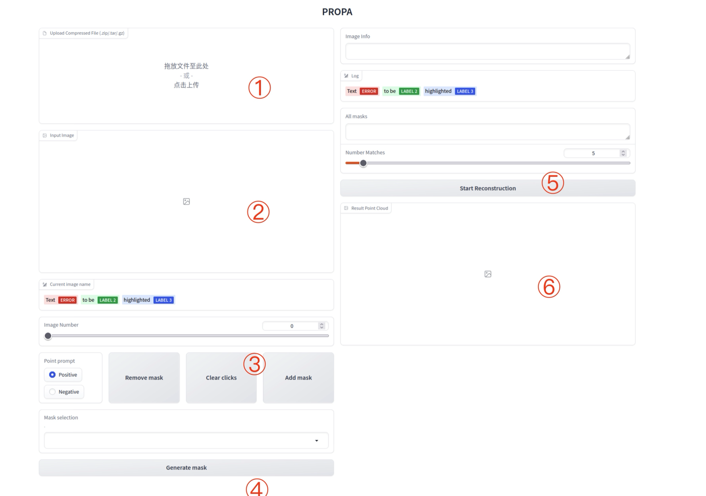
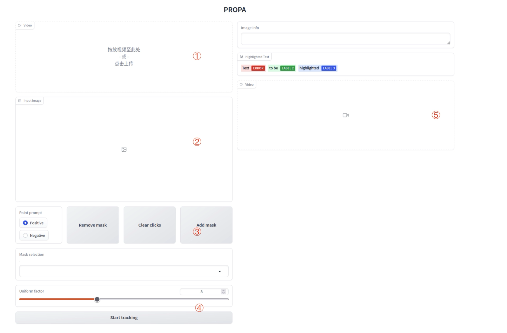

# Prompt Propagation for 3D Target Reconstruction

<div align=center class='img_top'>

</div>

**PROPA** is a prompt propagation-based target reconstruction framework, which identifies and segments target objects robustly from a sequence of images using foundation AI models and reconstructs the objects in 3D point cloud with the Multi-View Stereo method.

Compared with SAM2, PROPA performs better in segmentation of separated frames. We selected 100 frames of the same rice plant from different poses, and then used PROPA and SAM2 for segmentation of panicle. The results shows that PROPA produced good segmentation results in more than 40 frames, while SAM2 only produced good results in about 20 frames.

## Getting Started

### Clone PROPA
This project is tested under python3.9, cuda11.8 and pytorch1.13.0. An equivalent or higher version is recommended.

```shell
#Clone PROPA
git clone --recursive https://github.com/ganlab/PROPA.git
cd PROPA

#Install dependencies:
pip install -r requirements.txt
```

To apply target reconstruction, we use hloc toolbox for point matching. Please clone version 1.3 of hloc:

```shell
git clone --branch v1.3 --recursive https://github.com/cvg/Hierarchical-Localization.git HiLo
```

To apply video object segmentation, we use Tapnet for point matching. Please clone Tapnet: 
```shell
git clone https://github.com/google-deepmind/tapnet.git tapnet
```

### Install COLMAP && OpenMVS
Our reconstruction process is based on COLMAP and OpenMVS. Please follow the instruction and install [COLMAP](https://github.com/colmap/colmap) and [OpenMVS](https://github.com/cdcseacave/openMVS).

### Prepare Pre-trained Model
The model for SAM is required for PROPA, please download and put it in ```PROPA/checkpoint/```. The default model is [sam_vit_b_01ec64.pth](https://dl.fbaipublicfiles.com/segment_anything/sam_vit_h_4b8939.pth).
The model for Tapnet is required if you want to apply VOS. Please download the checkpoint for TAPIR and put it in ```/PROPA/tapnet/checkpoints```, the default model is [bootstapir_checkpoint](https://storage.googleapis.com/dm-tapnet/bootstap/bootstapir_checkpoint_v2.npy).

## Target Reconstruction
We create a web user interface for target reconstruction based on gradio:
```shell
python app_rec.py
```

The UI looks like:
<div align=center class='img_top'>

</div>

1. Upload the compressed file containing all the images to be reconstructed in ①. Supported formats include tar.gz and zip.
2. All images will be displayed at ②. You can drag the "Image Number" slider to select the image you want to segment. Click on the image to generate the segmentation result. If you are not satisfied with the segmentation result, you can click it multiple times.
3. You can modify "Positive" or "Negative" to select different types of prompts in ③. If multi-label is required, please click the "Add mask" button after selecting a label. After the entire image is segmented, click “Generate mask” button in ④ to generate a mask for the entire image. Then you can drag the "Image Number" slider to create mask for more images.
4. Drag the "Number Matches" slider in ⑤ to select the appropriate COLMAP parameters, and finally click the "Start Reconstruction" button. You can view the running log in the console. The visual effect of the point cloud will be available in ⑥ and the point cloud file can be found in ```reconstruction/<name-of-your-file>/output/dense_scene.ply```

## Video Object Segmentation
We also create a web user interface for video object segmentation based on gradio:
```shell
python app_vos.py
```

The UI looks like:
<div align=center class='img_top'>

</div>

1. Upload the video that you want to segment in ①.
2. The first frame of the video will be shown in ②. Click on the image to generate the segmentation result. If you are not satisfied with the segmentation result, you can click it multiple times.
3. You can modify "Positive" or "Negative" to select different types of prompts in ③. If multi-label is required, please click the "Add mask" button after selecting a label. After the entire image is segmented, click “Generate mask” button in ④ to generate a mask for the entire image.
4. Click the "Start tracking" button in ④ to start tracking. The result video will be shown in ⑤.

## Citation
Please considering cite our paper if you find this work useful!
```
```

## Acknowledgements
This work is based on [Segment Anything](https://github.com/facebookresearch/segment-anything), [COLMAP](https://github.com/colmap/colmap), [OpenMVS](http://github.com/cdcseacave/openMVS), [Hierarchical-Localization](https://github.com/cvg/Hierarchical-Localization) and [Tapnet](https://github.com/google-deepmind/tapnet)

## License
Free for non-profit research purposes. Please contact authors otherwise. The program itself may not be modified in any way and no redistribution is allowed.
No condition is made or to be implied, nor is any warranty given or to be implied, as to the accuracy of PROPA, or that it will be suitable for any particular purpose or for use under any specific conditions, or that the content or use of PROPA will not constitute or result in infringement of third-party rights.
The software is developed by following author(s) and supervised by Prof. Xiangchao Gan(gan@njau.edu.cn)

Authors:

Weikun Zhao
zhaowk@stu.njau.edu.cn
work: overall frame work, vos module, propagation of prompt, segmentation module, web UI based on gradio

Jiexiong Xu
xujx@stu.njau.edu.cn 
work: selection and evaluation of prompt, connection using undirected graph, target MVS, selection of pose
